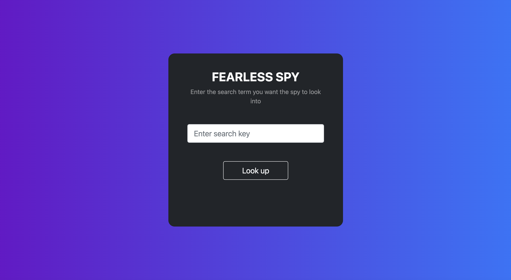

# Fearless Spy

        

## Overview

Fearless Spy is a web app that scrapes tweets from twitter and using sentimental analysis, returns a report on whether the tweets were psoitive, negative or neutral. It also creates a fun word cloud made up of the all the scraped tweets. The front-end was made with HTML and Bootstrap, and the backend was in Python with the Flask framework. 

## Demo

https://user-images.githubusercontent.com/97172421/205478435-63bd8f0b-095c-4dbd-a6f5-4565a5ed698d.mp4

## Miscellanous

The story of the 2 jupyter notebooks. So initially I tried to use the twitter API (tweepy library) to scrape tweets, however the free tier only allowed tweets from the past 7 days to be scraped, and even though that might have been enough, I wanted more flexibility. Also the twitter API Docs are so frustrating, and poorly written. So, out of frustration, I used the selenium web driver to manually login to twitter, and scrape tweets. So I literally went: 

The driver.ipynb shows this work. Once I cooled down, I realized that this really would not be feasible, opening the browser for every request, logging in, scrolling through tweets and so on. So luckily, I found a library called  SNScrape which made life so much easier. The backend.ipynb notebook basically shows this work. This notebook basically breaks down the code in the scrape.py file, and also shows some data visualization. So feel free to check out both notebooks

## Skills Acquired

-> Learnt alot about the flask framework, loading pages and animations in javascript

-> Learnt some basic nlp and concepts like polarity and subjectivity

-> Also learnt about the Boostrap framework, how to design components like cards and carousels

## Possible future developments

-> Would love to maybe make the final report a little more interactive.

-> For the sentimental analysis, the textblob library was used, and although its great, it has its shortcomings. Would love to comeback to this project in the future improve the ML model.

